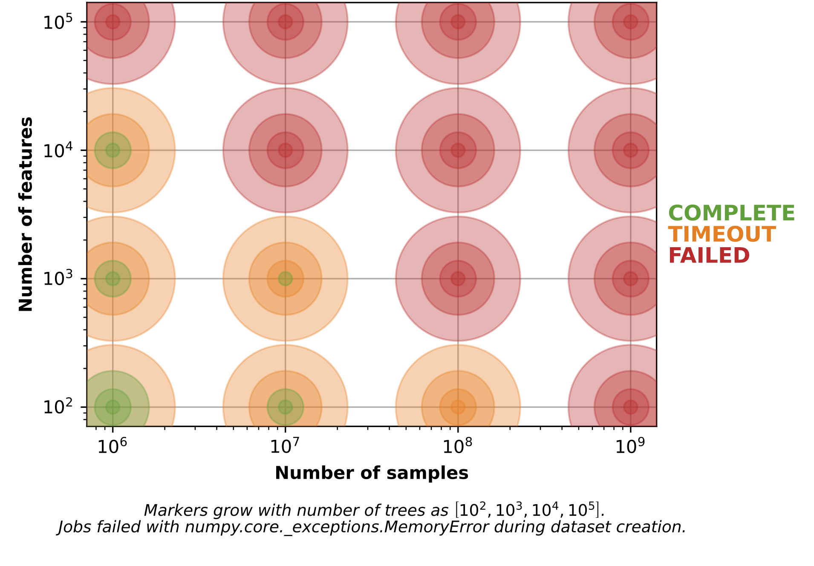
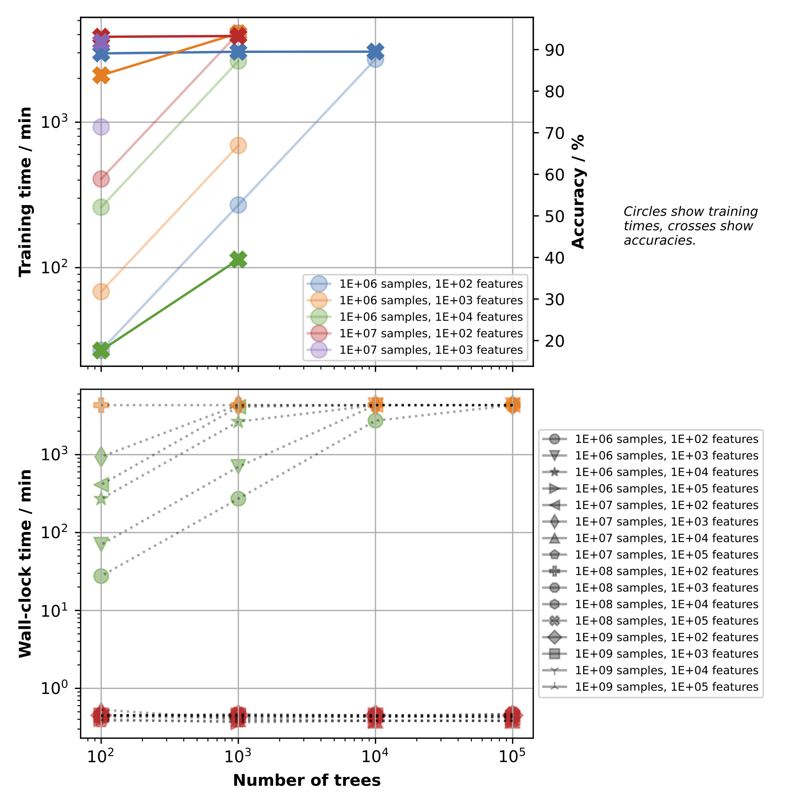

# On the Scalability of Random Forests: Overview of Experiments

Compute time status before starting experiments on 2023-10-06:

| Project                   | Resources | Granted | Used  | Percentage |
|---------------------------|-----------|---------|-------|------------|
| `hk-project-test-aihero2` | cpu       | 1000000 | 66639 | 6.66%      |

## Single-Node Experiments

### Why?

To find out the maximum problem size we can fit on a single compute node and to get a feeling for numbers and runtimes.

### What?
Consider a synthetic classification dataset (generated with `sklearn`'s `make_classification`) with $n$ 
samples and $m$ features. We train a random forest with $t$ trees. Assume trees are free to grow to their maximum depth
$\mathcal{O}\left(n\log n\right)$. For `sklearn`'s `RandomForestClassifier`, the default number of features considered 
when looking for the best split is $\sqrt{m}$.

### How?

From above, we know that the overall time complexity for training a random forest is 
$\mathcal{O}\left(t u n \log n\right)$, where $u$ is the number of features considered for splitting. 
Thus, three adjusting screws determine the base problem size:

**Model-related:**
* Number of trees $\rightarrow \mathcal{O}\left(t\right)$

**Data-related:**
* Number of samples $\rightarrow \mathcal{O}\left(n\log n\right)$
* Number of features $\rightarrow \mathcal{O}\left(u\right)=\mathcal{O}\left(\sqrt{m}\right)$

We do a grid search of the following search space:
* $t \in \left[10^2, 10^3, 10^4, 10^5\right]$
* $n \in \left[10^6, 10^7, 10^8, 10^9\right]$
* $m \in \left[10^2, 10^3, 10^4, 10^5\right]$

This makes overall 64 experiments for the single-node capacity series.

| $n$    | $m$    | $t$    | 
|--------|--------|--------|
| $10^6$ | $10^2$ | $10^2$ | 

### Results

Compute time status after single-node experiments on 2023-10-17 
(not sure whether another person also uses this compute time contingent):

| Project                   | Resources | Granted | Used   | Percentage |
|---------------------------|-----------|---------|--------|------------|
| `hk-project-test-aihero2` | cpu       | 1000000 | 135795 | 27.16%     |

#### Single-Node Capacity

This plot shows the state of each job, i.e., `COMPLETED` (green), `TIMEOUT` (orange), or `FAILED` (red), 
depending on the job's corresponding number of samples, number of features, and number of trees.

The data points for runs considering the same dataset, i.e., same number of samples and features, but different numbers 
of trees overlap, where the marker size grows with the number of trees and runs using the smallest number of trees are
shown innermost on top.

Runs using datasets with more than $n\cdot m= 10^{11}$ elements failed due to a `numpy.core._exceptions.MemoryError` 
during the dataset creation, i.e., `"Unable to allocate x TiB for an array with shape (n, m) and data type float64"`.
Those are all runs shown in red.

Runs with job state `TIMEOUT` ran into the single-node wall time limit of 3 days. These configurations are in principle 
trainable on a single node. They do not suffer from insufficient memory but are canceled due to the limited wall time. 
This can be mitigated by training the forest in a tree-parallel manner on multiple nodes.

Note that this does not solve the memory problem during dataset creation for datasets with more than $n\cdot m= 10^{11}$ 
elements as each node generates the complete dataset also in the parallel case (before potentially chunking into 
rank-specific subsets).

In the following experiments, we thus consider datasets with $n\cdot m= 10^{10}$ elements as the single-node maximum,
i.e., 
$\lbrace n, m\rbrace=\lbrace 10^6, 10^4\rbrace$,
$\lbrace n, m\rbrace=\lbrace 10^7, 10^3\rbrace$, and 
$\lbrace n, m\rbrace=\lbrace 10^8, 10^2\rbrace$.

As we are primarily interested in datasets with many features, we focus on the $\lbrace n, m\rbrace=\lbrace 10^6, 10^4\rbrace$ 
dataset. 
Additionally, we keep the $\lbrace n, m\rbrace=\lbrace 10^7, 10^3\rbrace$ for comparison (and because it probably 
reflects a more realistic ratio of number of samples and number of features).

#### Accuracy and Time to Train

As mentioned before, we focus on the following two datasets: 
* $\lbrace n, m\rbrace=\lbrace 10^6, 10^4\rbrace$ 
* $\lbrace n, m\rbrace=\lbrace 10^7, 10^3\rbrace$

Considering the accuracy, the $\lbrace n, m\rbrace=\lbrace 10^6, 10^4\rbrace$ dataset shows more room for improvement 
when adding more trees, making it particularly interesting for the next series of (scaling) experiments where we study 
the accuracy as a function of the number of trees, among other things.

## Scaling Experiments

### Why
To study strong and weak scaling of our distributed random forest implementation as well as the accuracy as a function 
of the number of trees $t$.

### What
Consider the two datasets identified in the single-node capacity experiments, i.e., 
$\lbrace n, m\rbrace=\lbrace 10^6, 10^4\rbrace$ and $\lbrace n, m\rbrace=\lbrace 10^7, 10^3\rbrace$.
Given the job constraints on HoreKa, we use the following configurations as preliminary base problems:
* $\lbrace n, m, t\rbrace=\lbrace 10^6, 10^4, 10^3\rbrace$
* $\lbrace n, m, t\rbrace=\lbrace 10^7, 10^3, 10^2\rbrace$

### How
We scale the problem size by varying the number of trees $t$. For a constant dataset with fixed number of samples $n$ 
and fixed number of features $n$, training has a time complexity of $\mathcal{O}\left(t\right)$, i.e., it scales linearly 
with $t$.

### Strong Scaling
For strong scaling, we aim at solving a problem of fixed size faster by ramping up the compute resources used to solve the 
problem. 
For the distributed RF, this means we take the base problems and solve them using increasingly more compute nodes. 
Thus, the global forest is distributed over more compute nodes, decreasing the node-local number of trees. 
For $p$ nodes, each node trains a local forest of $t/p$ trees.
Quantity of interest is the speed-up:

$$S\left(p\right)=\frac{\text{sequential runtime}}{\text{parallel runtime}}=\frac{T_s}{T_p}$$

Ideally, the speed-up should increase linearly with the number of processors $p$, i.e., each processor works on a 
fraction $1/p$ of the problem without any parallelization overhead.

We start from each base problem and solve it using 1, 2, 4, 8, 16, 32, and 64 nodes. Each node should see the complete 
global dataset (no chunking). The accuracy should stay constant.

### Weak Scaling
For weak scaling, both problem size and compute resources used to solve the problem are ramped up proportionally to each other. 
For the distributed RF, this means that we double the number of trees as we double the number of nodes. 
We aim at solving the problem in a constant amount of time over the complete series of experiments. 
Quantity of interest is the efficiency:

$$E\left(p\right)=\frac{S\left(p\right)}{p}=\frac{T_s}{pT_p}$$

The efficiency is a measure of how well the additional processors are used in the parallel case.

We start from each base problem and increase the number of trees accordingly as we increase the number of nodes.
Again, we consider 1, 2, 4, 8, 16, 32, and 64 nodes. Each node should see the complete 
global dataset (no chunking). The accuracy can change as we scale the problem via the number of trees.

### Accuracy vs. Number of Trees
To study how the accuracy behaves as a function of the number of trees $t$, we can consider the weak scaling experiments.
Additionally, we might perform experiments considering numbers of trees smaller than that of the base problem size.

Before we perform this series of experiments, we try to find the maximum number of trees for our base problems defined above
that still train within the wall-time limit of HoreKa's single node queue, which is 3 d = 72 h.

* $\lbrace n, m, t\rbrace=\lbrace 10^6, 10^4, 10^3\rbrace$ training time: 44 h => Use $1.5\times t=1500 \approx 1472=23\cdot 64$ trees.
* $\lbrace n, m, t\rbrace=\lbrace 10^7, 10^3, 10^2\rbrace$: 16 h =>  Use $4.5\times t=450 \approx 448 = 7\cdot 64$ trees.

As the training time should scale linearly with the number of trees, there is still room for increasing the base problem 
size to harness the full 3 d wall-clock time. We use multiples of 64 for the number of trees $t$ to enable perfect load 
balancing in the scaling experiments across 64 nodes.

In addition to the training time, we explicitly measure the dataset creation time in this series of experiments.

Final setup of single-node baseline experiments:
* $\lbrace n, m, t\rbrace=\lbrace 10^6, 10^4, 1600\rbrace$ training time: 69.57 h
* $\lbrace n, m, t\rbrace=\lbrace 10^7, 10^3, 448\rbrace$ training time: 68.97 h

### Issues

The **single-node baseline** experiments require HoreKa's **high-memory nodes** with 512 GB main memory. 
The standard nodes with 256 GB main memory are not sufficient.
However, HoreKa only has 32 of these high-memory nodes but 570 standard nodes.

For strong scaling, this is not a problem as each node gets an inversely proportionally smaller number of trees to train
with increasing number of nodes. 
Thus, the standard nodes are sufficient for the 64-node strong scaling experiments.
All experiments ran without any problems on 1, 2, 4, 8, 16, 32, and 64 nodes.
Thus, we keep the aforementioned single-node baseline in this case as making the baseline problem smaller is not 
meaningful for strong scaling where the initial problem is scaled by increasingly distributing it over more compute 
resources.

Single-node baseline experiments for strong scaling:
* $\lbrace n, m, t\rbrace=\lbrace 10^6, 10^4, 1600\rbrace$ training time: 69.57 h
* $\lbrace n, m, t\rbrace=\lbrace 10^7, 10^3, 448\rbrace$ training time: 68.97 h

However, I ran into several issues with the weak scaling. As the problem size increases proportionally to the number 
of nodes and HoreKa has only 32 high-memory nodes, the 64-node experiment can not be conducted starting from the 
aforementioned single-node baselines.
In addition, some of those experiments ran into the 3 d wall-clock time limit as I underestimated the parallel overhead.

I try to solve this problem by decreasing the baseline problem size, using only half the number of trees, i.e.:

Single-node baseline experiments for weak scaling:
* $\lbrace n, m, t\rbrace=\lbrace 10^6, 10^4, 800\rbrace$
* $\lbrace n, m, t\rbrace=\lbrace 10^7, 10^3, 224\rbrace$

### Further Studies
In the current scaling experiments, all data, including the test set, is shared across all nodes. 
For inference, the votes of each subforest are all-gathered using histograms. The nodes do **NOT** hold the global model.
Alternatively, we could run the experiments again but use the `global_model` flag. In this case, each node would finally 
hold the global model obtained by serially all-gathering the local subforests tree by tree.
It might be interesting to compare those two variants in terms of runtime and parallelization overhead.