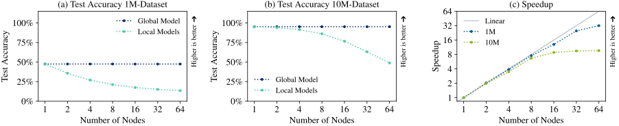
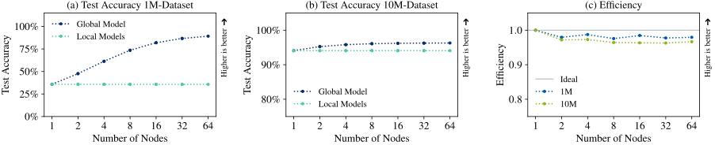

# Distributed Random Forests in Python with MPI

[](https://opensource.org/licenses/BSD-3-Clause)
[](https://github.com/astral-sh/ruff)
[](https://www.python.org/downloads/)
[](https://codecov.io/gh/Helmholtz-AI-Energy/special-couscous)
[](mailto:marie.weiel@kit.edu)
[](https://results.pre-commit.ci/latest/github/Helmholtz-AI-Energy/special-couscous/main)

``specialcouscous`` is a Python package for large-scale distributed training and inference of random forests on
supercomputers. It uses the message passing interface (MPI) for communication between parallel processes.


## Quick Start

### Installation
You can install ``specialcouscous`` directly from the main branch:
```
git clone https://github.com/Helmholtz-AI-Energy/special-couscous.git
cd special-couscous
pip install .
```
If you want to **contribute** to ``specialcouscous`` as a developer, you need to install the development dependencies:
```
pip install -e ."[dev]"
```
Parallel execution depends on [``mpi4py``](https://mpi4py.readthedocs.io/en/stable/) and requires an MPI implementation under the hood. Currently, it is only tested with [OpenMPI](https://www.open-mpi.org/).

### Usage
You can use `specialcouscous` either via the scripts provided in `scripts/` or via the Python interface.

Scripts for both serial and parallel runs are provided in `scripts/serial.py` and `scripts/parallel.py`.
For example, to reproduce our weak scaling results on the [HIGGS](https://archive.ics.uci.edu/dataset/280/higgs) dataset, run
```commandline
python -u scripts/parallel.py --dataset_name higgs --n_trees 10
```
with MPI on p nodes (depending on your system e.g. with `mpirun -n <p>` or with `srun`) and 
```commandline
python -u scripts/serial.py --dataset_name higgs --n_trees 10
```
for the serial baseline.
We offer an extensive command line interface, use the `--help` option to learn more.

Alternatively, you can also use `specialcouscous` in your own Python code, for example like this:

```python3
from mpi4py import MPI

from specialcouscous.rf_parallel import DistributedRandomForest
from specialcouscous.datasets import SyntheticDataset, get_dataset
from specialcouscous.utils import set_logger_config

set_logger_config()

n_trees = 100
seed = 0
shared_global_model = False

# Prepare the data
data = get_dataset("higgs", "data/")
train_data = SyntheticDataset(x=data.x_train, y=data.y_train)
test_data = SyntheticDataset(x=data.x_test, y=data.y_test)

# Train the random forest
distributed_random_forest = DistributedRandomForest(n_trees, MPI.COMM_WORLD, seed, shared_global_model)
distributed_random_forest.train(train_data.x, train_data.y)
if shared_global_model:
    distributed_random_forest.build_shared_global_model()

# Inference and evaluation of the random forest
distributed_random_forest.predict(test_data.x)
distributed_random_forest.score(test_data.x, test_data.y)

```

For an example on how to use `specialcouscous` with slurm, check out `scripts/slurm_scripts/`.

## Core Results
`specialcouscous` scales successfully, demonstrating a strong scaling speedup of up to 31.98 and a weak scaling efficiency of over 0.96 without affecting predictive performance of the global model.

**Strong Scaling**

**Weak Scaling**


`specialcouscous` offers two different modes of inference, either aggregating the global model (sequential inference, no data sharing) on all nodes or using distributed inference via global voting (lower memory consumption, no overhead for model aggregation, faster inference).
- **Global Model:** computational and memory overhead for sequential inference without data sharing
- **Global Voting:** lower memory consumption and faster inference thanks to parallel inference


## Citing `specialcouscous`
If you found `specialcouscous` useful, please cite our paper: coming soon 🚀

---
## Acknowledgments
This work was funded by Helmholtz Association’s Initiative and Networking Fund through the Helmholtz AI platform grant

The authors gratefully acknowledge the computing time provided on the high-performance computer HoreKa by the National High-Performance Computing Center at KIT (NHR@KIT). This center is jointly supported by the Federal Ministry of Education and Research and the Ministry of Science, Research and the Arts of Baden-Württemberg, as part of the [National High-Performance Computing (NHR) joint funding program](https://www.nhr-verein.de/en/our-partners). HoreKa is partly funded by the German Research Foundation (DFG).


