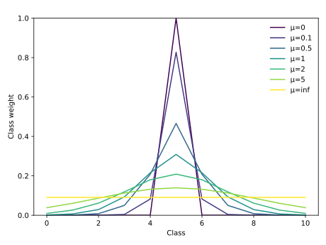
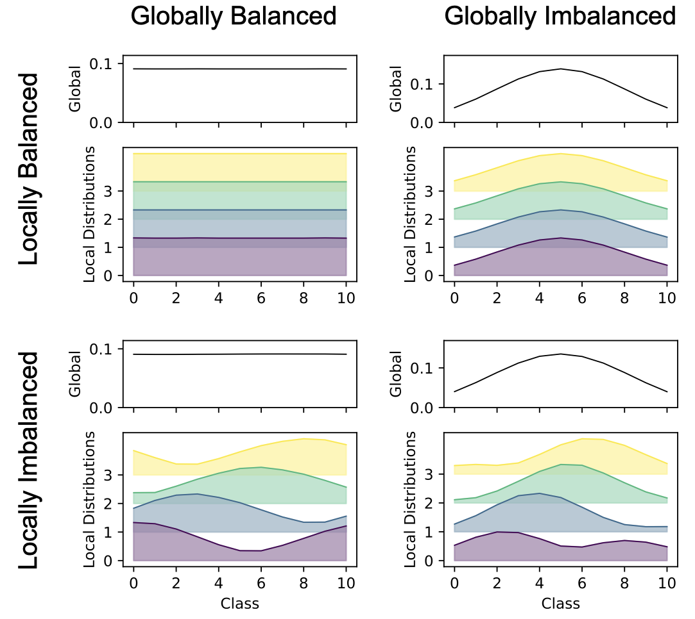
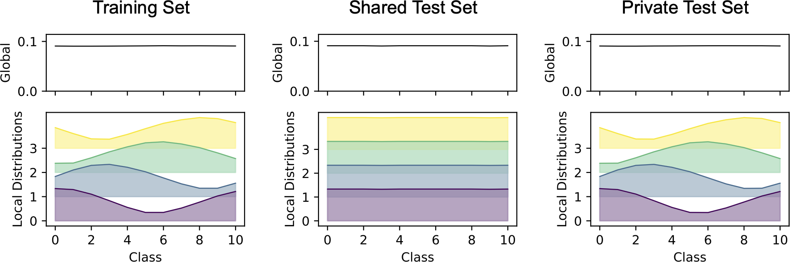

# Distributed Random Forests in Python with MPI

[](https://opensource.org/licenses/BSD-3-Clause)
[](https://github.com/psf/black)
[](https://www.python.org/downloads/)
[](mailto:marie.weiel@kit.edu)


``specialcouscous`` is a Python package for large-scale distributed training and inference of random forests on
supercomputers. It uses the message passing interface (MPI) for communication between parallel processes.

## Installation
- You can install ``specialcouscous`` directly from the main branch.
Pull and run: ``pip install .``
- If you want to **contribute** to ``specialcouscous`` as a developer, you need to install the required dependencies
  with the package:
``pip install -e ."[dev]"``.

``specialcouscous`` depends on [``mpi4py``](https://mpi4py.readthedocs.io/en/stable/) and requires an MPI implementation
under the hood. Currently, it is only tested with [OpenMPI](https://www.open-mpi.org/).

## Synthetic Classification Data
We generate synthetic datasets using [sklearn's `make_classification`](https://scikit-learn.org/stable/modules/generated/sklearn.datasets.make_classification.html).
All additional options, such as the number of features, clusters per class, and class separation, can be passed through.

### Breaking IID: Different Options for Class (Im)Balance

#### Skellam Distribution
The class imbalance follows a [Skellam distribution](https://en.wikipedia.org/wiki/Skellam_distribution), defined by a peak (the class with the highest probability) and μ = μ₁ = μ₂ which adjusts the spread of the distribution.
The larger μ, the larger the spread.
Edge cases: For μ=0, the peak class has weight 1, while all other classes have weight 0.
For μ=inf, the generated dataset is balanced, i.e., all classes have equal weights.
Beware that with very strong imbalances, the train-test split may fail if a class has only a single sample.
This is especially common when using local test sets.

The following figure illustrates the class weight for 11 classes using different μ and a peak at class 5.



#### Generating the Dataset
The dataset is generated using sklearn's `make_classification`.
The classes can be either balanced or imbalanced using a Skellam distribution.
This is referred to as *global* (im)balance in contrast to the local imbalance caused by the partition (see below).

#### Partitioning and Distributing the Dataset
To distribute the dataset across ranks, it is first generated locally on each rank using the same random seed.
Then, the samples are assigned to ranks and each rank selects its assigned subset.
This partition can again be either balanced or imbalanced (referred to as *local* (im)balance).
In the balanced case, the samples of a class are distributed equally across all ranks, i.e., each class has (roughly) the same frequency in the global and all local datasets.

In the imbalanced case, the samples of a class are distributed based on rank-wise class weights.
The class weights are based on a Skellam distribution.
Each rank has its own distribution, the peaks are spaced linearly on [0, num_classes - 1] considered as ring.
The spread of all distributions depends on the μ = μ₁ = μ₂ parameter of the Skellam distribution.

The samples of a class are partitioned according to the relative weights of all ranks for that class.
When combining global and local imbalance, this results in the ranks receiving different amounts of data with ranks whose local peak aligns more with the global peak receiving more samples.

#### Four Combinations of Global and Local Balance
Combining the dataset generation with the partitioning results in four different combinations of global and local (im)balance.
The following image illustrates the class distribution of the training set for these four combinations for 11 classes, 8k samples, and four ranks.
The peak of the global distribution is at the center class (id five) and μ is set to five for both dataset generation and partition.


#### Shared or Private Test Dataset
The test dataset can be either private or shared between all ranks.
This also affects the class distributions and size of the local test set.
With a shared test set, the train-test split is performed before partitioning the data among the ranks.
With a private test set, each rank performs its own train-test split on the local data.


### Usage

To generate a dataset in Python, `synthetic_classification_data.generate_and_distribute_synthetic_dataset` combines both data generation and partition into a single function.
Alternatively, `rf_training_breaking_iid` can be used directly which combines the above function with random forest training and evaluation.

Minimum working example:

```python3
from mpi4py import MPI

from specialcouscous.synthetic_classification_data import generate_and_distribute_synthetic_dataset
from specialcouscous.rf_parallel import DistributedRandomForest

comm = MPI.COMM_WORLD
num_samples = 10000
num_classes = 10
seed = 0
test_size = 0.2
n_trees = 100

shared_test_set = True
global_model = True

globally_balanced = False
mu_data = 5
peak = num_classes // 2

locally_balanced = False
mu_partition = 5

global_dataset, local_train, local_test = generate_and_distribute_synthetic_dataset(globally_balanced, locally_balanced,
                                                                                    num_samples, num_classes, comm.rank,
                                                                                    comm.size, seed, test_size,
                                                                                    mu_partition, mu_data, peak,
                                                                                    shared_test_set=shared_test_set)
distributed_random_forest = DistributedRandomForest(n_trees_global=n_trees, comm=comm, random_state=seed,
                                                    global_model=global_model)
distributed_random_forest.train(local_train.x, local_train.y, global_model)
distributed_random_forest.evaluate(local_test.x, local_test.y, num_classes, global_model)
```
